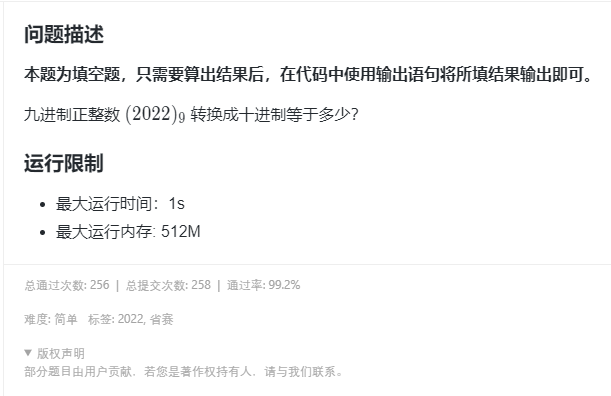

## 题目描述

[](https://www.lanqiao.cn/problems/2095/learning/)


## code

按进制定义直接求解

`2 * (9 ^ 3) + 0 * (9 ^ 2) + 2 * (9 ^ 1) + 2 * (9 ^ 0)`

```cpp
#include <bits/stdc++.h>
using namespace std;

int main() {
    printf("%d", 2 * 729 + 2 * 9 + 2);
    return 0;
}
```