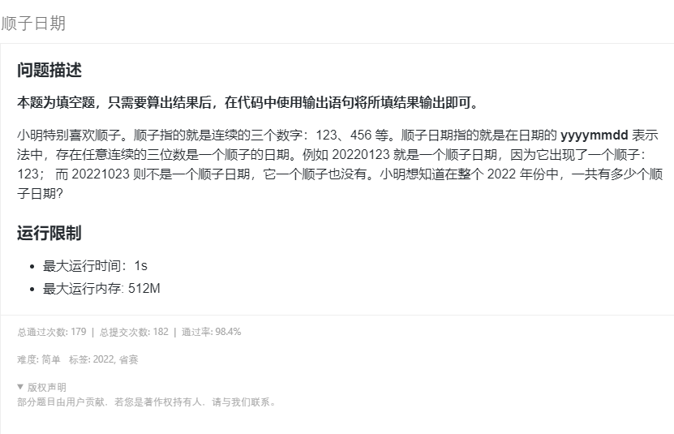

## 题目描述

[](https://www.lanqiao.cn/problems/2096/learning/)

## code:

由于题干描述，误导参赛者认为 `012` 不是顺子。 

直接数：

- 2022_012[0-9]
- 2022_1012
- 2022_1123

```cpp
#include <iostream>
using namespace std;

int main() {
    printf("14\n");
    return 0;
}
```