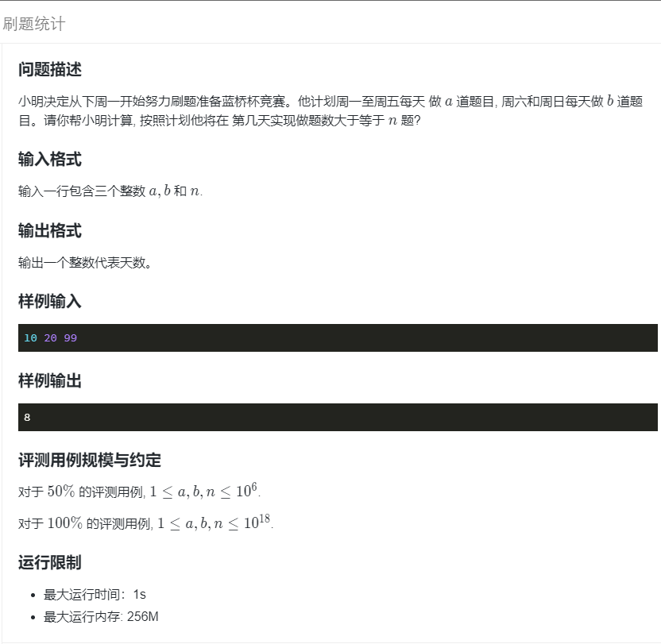

## 题目描述

[](https://www.lanqiao.cn/problems/2098/learning/)

## code

- `res` 记录需要的天数，`n` 记录当前要做的题目数， `a` 周一到周五刷题数， `b` 周六周日刷题数
- 一周刷题量 `week = 5 * a + 2 * b`, 可以先算出整周刷题刷了几周：`res = (n / week) * 7`
- 剩余 `n %= week` 道题，不足一周。按天做题
- `res % 7` 判断当前星期几, `(res % 7 == 6 || res % 7 == 0）` 为双休日
- `while(n > 0)` 当还没有达到做题数， 所需天数`res++`， 题目数 `n -= 当天要做的题目数`。
- 最后注意数据范围：`10 ^ 18`
### c++

```cpp
#include <bits/stdc++.h>
using namespace std;
int main() {
    long long a, b, n;
    // scanf("%lld %lld %lld", &a, &b, &n);
    cin >> a >> b >> n;
    long long week = 5 * a + 2 * b, res = (n / week) * 7;
    n %= week;
    while (n > 0) {
        res++;
        n -= (res % 7 == 6 || res % 7 == 0) ? b : a;
    }
    // printf("%lld\n", res);
    cout << res << endl;
    return 0;
}
```