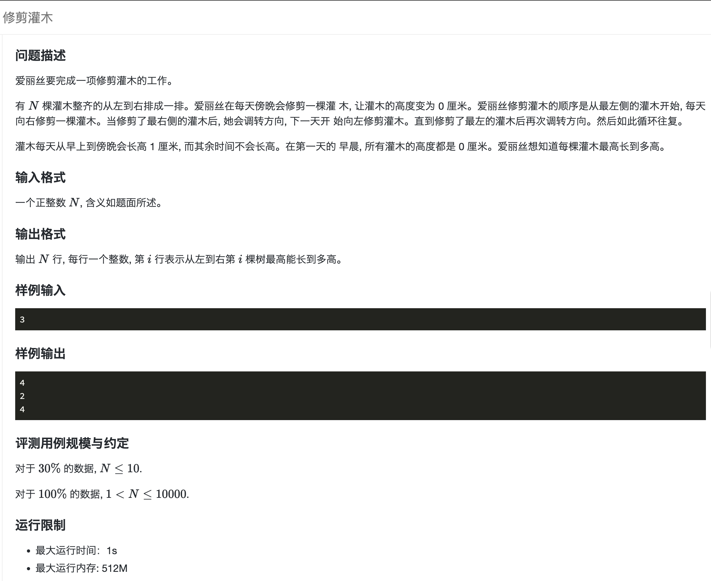
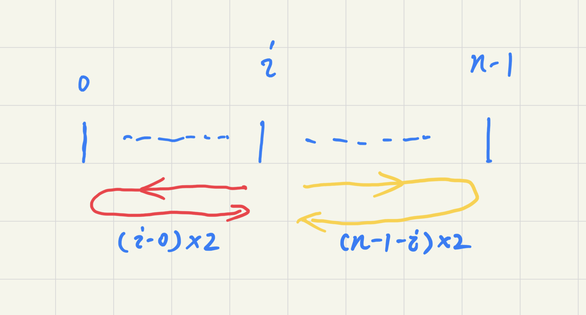

## 题目描述

[](https://www.lanqiao.cn/problems/2107/learning/)

## code



如图，树每天长高1，被经过时会被剪为0。 编号 `0 ～ n - 1`， 第 `i` 棵树最多生长天数有两种可能：

1. 从 i 向右再折返回 i 点：(n - i - 1) * 2
2. 从 i 向左再折返回 i 点：i * 2

两者取最大值

```cpp
#include <bits/stdc++.h>
using namespace std;

int main() {
    int n;
    // scanf("%d", &n);
    cin >> n;
    for (int i = 0; i < n; i++) {
        //printf("%d\n", max(i, n - i - 1) * 2);
        cout << (max(i, n - i - 1) * 2) << endl;
    }
    return 0;
}
```