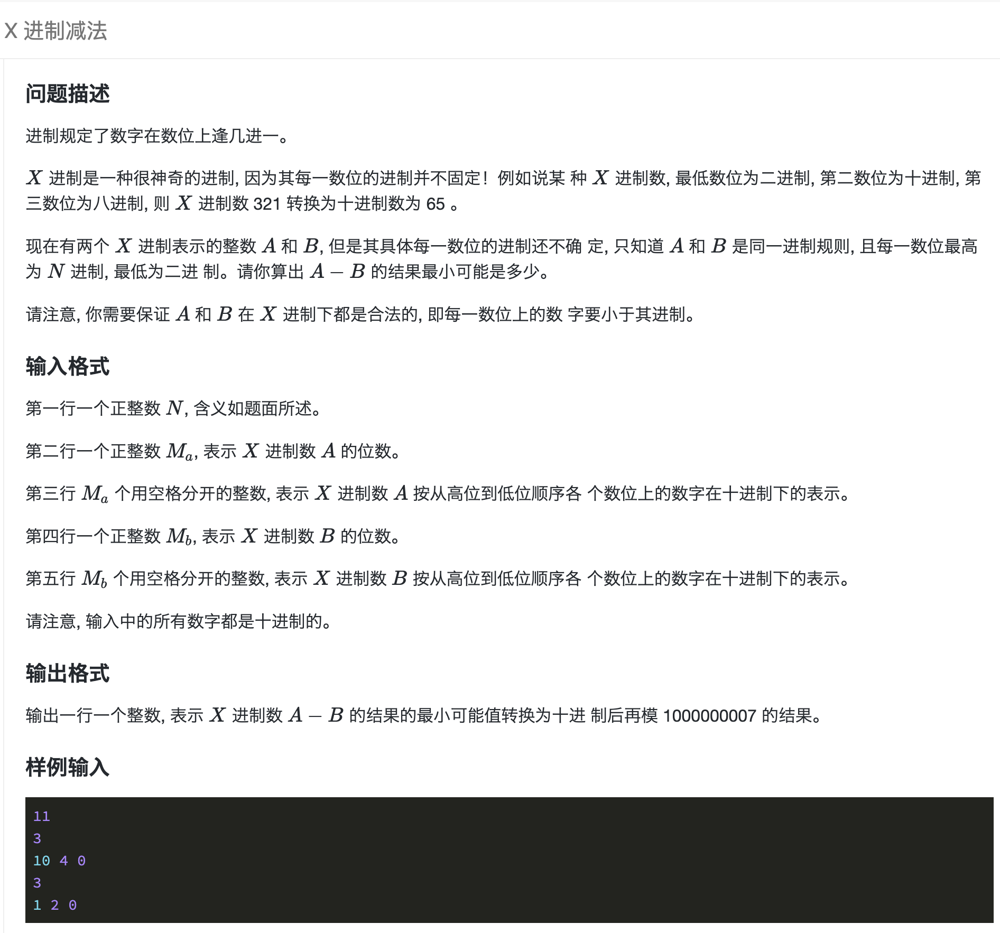
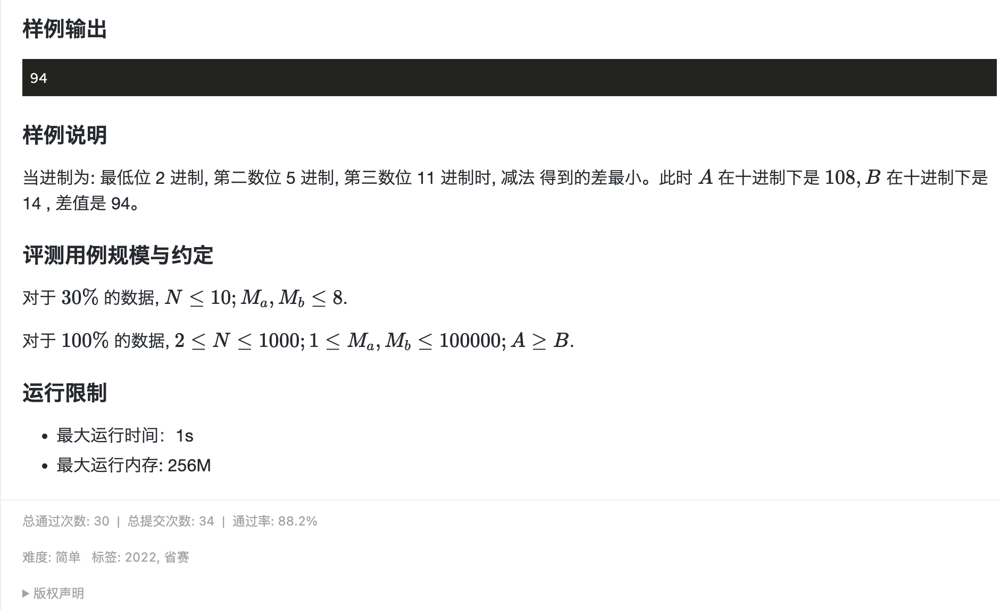

## 题目描述


[](https://www.lanqiao.cn/problems/2108/learning/)

[](https://www.lanqiao.cn/problems/2108/learning/)

## code

### 1. 先搞清 `321` 转十进制为 `65` 怎么来

题干第一句补充进制概念`逢几进一`，第三位的 `3` 是由第二位逢十进一三次所得，相当于 `3*10` 个第二位，同理第二位的`2`是由第一位逢二进一两次所得，所以转成十进制：`3*10*2 + 2*2 + 1 = 65`

### 2. 进制越小，两数差距越小。

简单证明：

```cpp
// 如果数位从低往高存(A[0] 为最低位)，把 A 和 B 转为十进制：
// X[i] 表示第i位进制
A[i] * (X[i - 1] * X[i - 2] ... * X[0]) + A[i - 1] * (X[i - 2] *  X[i - 3] ... * X[0])  + ... + A[0]

B[i] * (X[i - 1] * X[i - 2] ... * X[0]) + B[i - 1] * (X[i - 2] *  X[i - 3] ... * X[0])  + ... + B[0]

// 做减法：
A - B = (A[i] - B[i]) * (X[i - 1] * X[i - 2] ... * X[0]) + ... + (A[0] - B[0])
```

A - B = $\sum_{i=0}^{n-1} {(A[i] - B[i])*(\prod{X[i - 1]})}$

- 如果所有 A[i] - B[i] > 0, 则 $\prod{X[i - 1]}$ 越小越好，也就是每一位进制 X[i] 越小越好
- 如果存在 A[i] - B[i] < 0, 为满足 A >= B，需要在 `i + 1 ~ n - 1` 位上找补，使得 `C = (A[n - 1] - B[n - 1]) * (X[n - 2] * ... * X[i]) + ... + (A[i] - B[i])` 整体大于等于0， `A - B = C * (X[i - 1] * ... * X[0]) + (A[i - 1] - B[i - 1]) * (X[i - 2] * ... * X[0]) + ... + (A[0] - B[0])`。 全是正数，所以X[i] 还是越小越好

### 3. 输入数据

- A >= B, 所以 A的位数 >= B的位数， `ma >= mb`
  - 开两个 `ma` 长度的数组，从低位往高位存。如果 `mb <= i < ma`, `A[i] - B[i] == A[i] - 0 == A[i]`, 避免下标判断
- 每一位进制最小：`X[i] > A[i] && X[i] > B[i]`，否则就会发生进位，所以X[i]的最小值要满足`max(A[i], B[i]) + 1`, 同时要满足最小为2，`max(max(A[i], B[i]) + 1, 2)`
- 膜运算：
  - (a + b) % mod = (a % mod + b % mod) % mod
  - (a * b) % mod = (a % mod * b % mod) % mod
  - a ^ b % mod = ((a % mod)^b) % mod

### cpp

```cpp
#include <bits/stdc++.h>
using namespace std;

const long long mod = 1e9 + 7;
int main() {
    int n, ma, mb;
    cin >> n >> ma;
    vector<int> A(ma), B(ma);
    for (int i = ma - 1; i >= 0; i--) {
        cin >> A[i];
    }
    cin >> mb;
    for (int i = mb - 1; i >= 0; i--) {
        cin >> B[i];
    }
    long long res = 0, x = 1;
    for (int i = 0; i < ma; i++) {
        res = ((A[i] - B[i]) * x + res) % mod;
        x = max(2, max(A[i], B[i]) + 1) * x % mod;
    }
    cout << res << endl;
    return 0;
}
```

### c

```c
#include <stdio.h>

const long long mod = 1e9 + 7;

int max(int v1, int v2) {
    return v1 < v2 ? v2 : v1;
}

int main() {
    int n, ma, mb;
    scanf("%d", &n);
    scanf("%d", &ma);
    int A[100005] = {0}, B[100005] = {0};
    for (int i = ma - 1; i >= 0; i--) {
        scanf("%d", A + i);
    }
    scanf("%d", &mb);
    for (int i = mb - 1; i >= 0; i--) {
        scanf("%d", B + i);
    }
    long long res = 0, x = 1;
    for (int i = 0; i < ma; i++) {
        res = ((A[i] - B[i]) * x + res) % mod;
        x = max(2, max(A[i], B[i]) + 1) * x % mod;
    }
    printf("%lld\n", res);
    return 0;
}
```