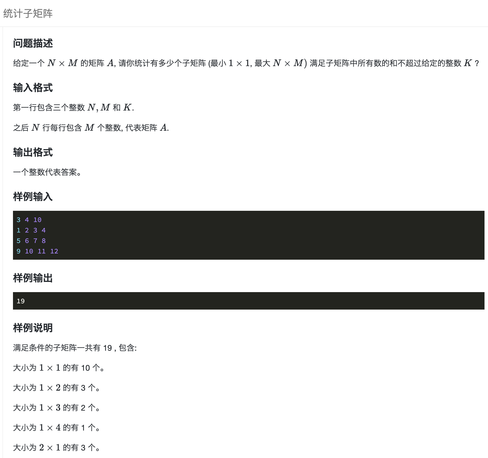
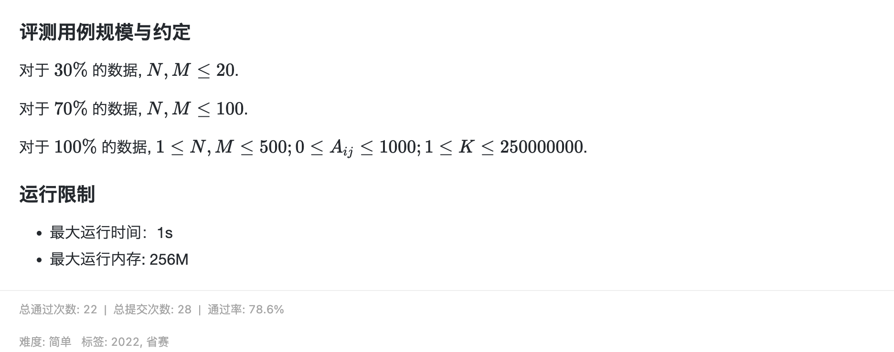

## 题目描述


[](https://www.lanqiao.cn/problems/2109/learning/)

[](https://www.lanqiao.cn/problems/2109/learning/)


## code

简单 前缀和 + 滑动窗口

从矩阵左上角 `(1, 1)` 往 右下角 `(n, m)` 一点点扩大，每当矩阵数和大于 `k`, 则调整左上角，向右向下缩小矩阵直到数和小于 `k`

- `a[x][y]` 存第 `y` 列第`1 ~ x` 行数字和
- `i` 遍历上边界的行号
- `j` 遍历下边界的行号
- `l`, `r` 遍历左右边界的列号
- `sum` 记录矩阵 `左上点(i, l)->右下点(j, r)` 所有数字和。
- `res` 子矩阵数，题目结果

每次上下边界`i, j`定好后, `l, r` 从第一列开始，此时矩阵数和`sum`等于第`r`列第`i ~ j`行的数字和。`a[x][y]` 存第 `y` 列前 `x` 行数字和, 所以`i ~ j`行可以通过前`j`行的和减去前`i-1`行的和得到，`sum = a[j][r] - a[i - 1][r]`，

之后每次`r++`往右走，sum 加上新增列的值。

如果`sum > k`, 缩小左边界，`sum` 减掉最左侧列: `sum -= a[j][l] - a[i - 1][l]`, `l++` 左边界往右。 重复此过程直到`sum <= k`。

> 数据范围 1 <= n,m <= 500, c语言没法`int a[n][m] = {0}`的方式开数组，只能预留最大空间 `int a[502][502] = {0}` 容易爆空间，最好自己 malloc 动态开。

```cpp
#include <bits/stdc++.h>
using namespace std;
int main() {
    int n, m, k;
    cin >> n >> m >> k;
    // int a[502][502] = {0};
    vector<vector<int>> a(n + 1, vector<int>(m + 1, 0));
    for (int i = 1; i <= n; i++) {
        for (int j = 1; j <= m; j++) {
            cin >> a[i][j];
            a[i][j] += a[i - 1][j];
        }
    }
    unsigned long long res = 0;
    for (int i = 1; i <= n; i++) {
        for (int j = i; j <= n; j++) {
            int sum = 0;
            for (int l = 1, r = 1; r <= m; r++) {
                sum += a[j][r] - a[i - 1][r];
                while (sum > k) {
                    sum -= a[j][l] - a[i - 1][l];
                    l++;
                } 
                res += r - l + 1;
            }
        }
    }
    cout << res << endl;
    return 0;
}
```