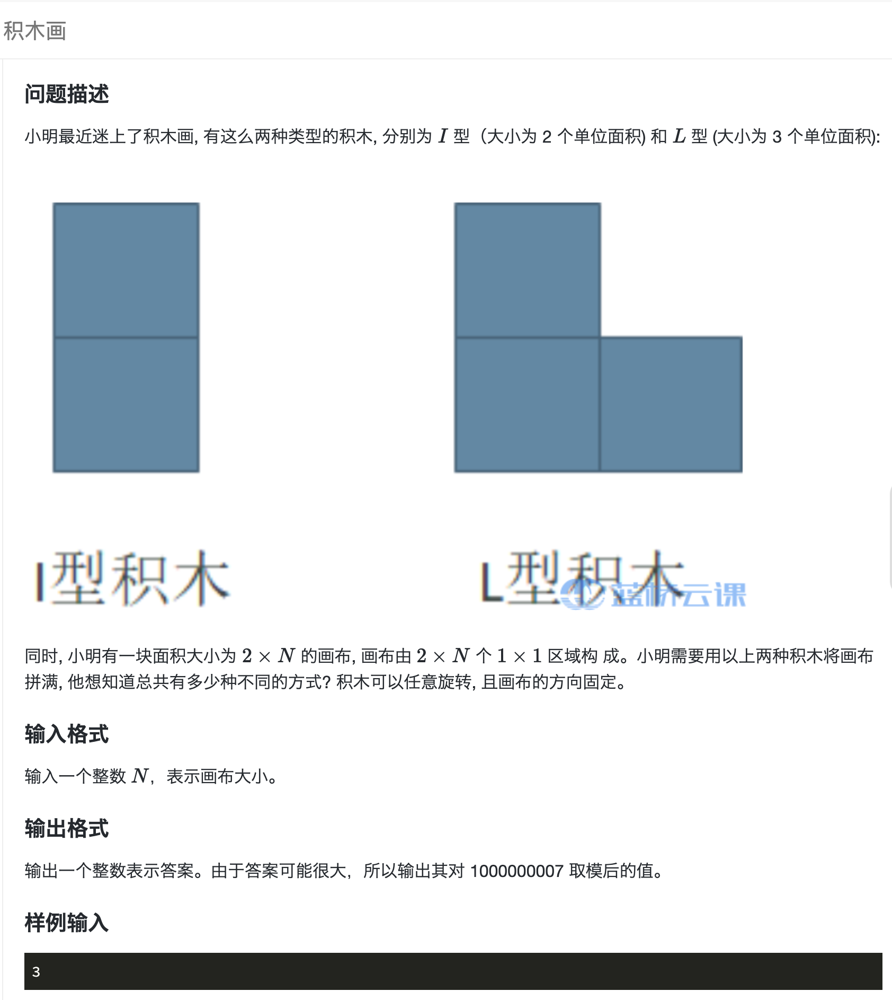
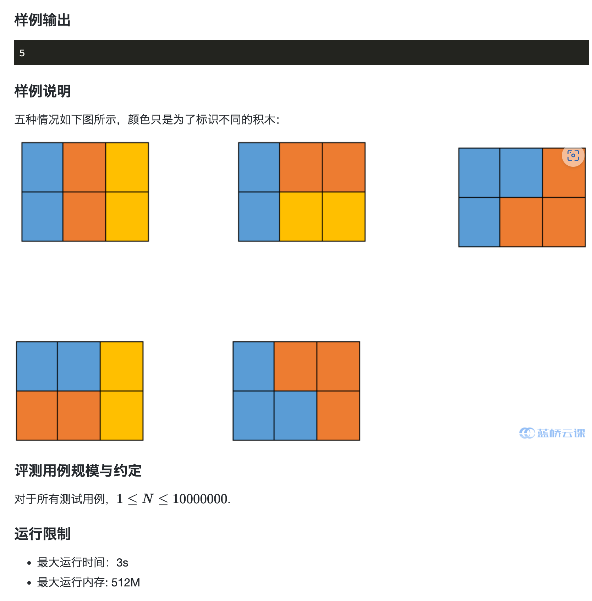
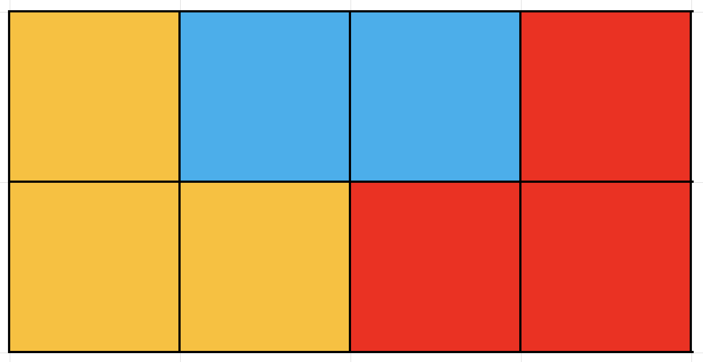
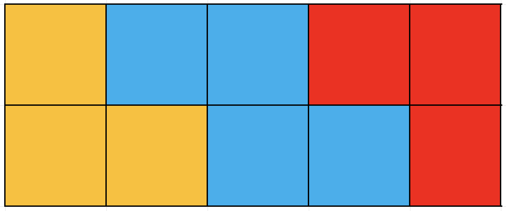

## 题目描述


[](https://www.lanqiao.cn/problems/2110/learning/)

[](https://www.lanqiao.cn/problems/2110/learning/)

## code 

递推。

dp[i] 存画布尺寸为 2 * i时， 一共有几种方式。

### 1. 先考虑只有 `I型积木`。 有两种情况: 

- 前 `i - 1` 已经放好，再放一个竖向`I型积木`。
- 前 `i - 2` 已经放好，再放两个横向`I型积木`。（不存在放两个竖向`I型积木`的情况，因为已经包含在第一种情况里）

所以 `dp[i] = dp[i - 1] + d[i - 2]`

### 2. 增加`L型积木`

`L型积木` 必须成对出现，至少需要2 * 3的空间，如样例说明 `图3` `图5`，所以，在`i - 3`已经放好的基础上，有`dp[i - 3] * 2`种方式摆满画布

如果空间为 `2*4, 2*5, 2*6 ...`, 也可以摆满：

 

如图所示只要两头为 `L型积木`， 中间填充横向`I型积木`，都可以填满画布。 所以只要画布尺寸不小于`2*3`: `dp[i] += dp[i - 1] + d[i - 2] + 2 *(dp[i - 3] + d[i - 4] + ... + dp[1])`。

### ps: 

- 此时 `dp[0]` 是空闲的，所以可以用来记`dp[1] ~ dp[i - 3]`之和。
- 膜运算：
  - (a + b) % mod = (a % mod + b % mod) % mod
  - (a * b) % mod = (a % mod * b % mod) % mod
  - a ^ b % mod = ((a % mod)^b) % mod

### c++

```cpp
#include <bits/stdc++.h>
using namespace std;

const long long MOD = 1e9 + 7;

int main() {
    int n;
    cin >> n;
    vector<int> dp{1, 1, 2};
    for (int i = 3; i <= n; i++) {
        dp.emplace_back(((dp[i - 1] + dp [i - 2]) % MOD + dp[0] * 2 % MOD) % MOD);
        dp[0] += dp[i - 2];
        dp[0] %= MOD;
    }
    cout << dp[n] << endl;
    return 0;
}
```

### c

```c
#include <stdio.h>

const long long MOD = 1e9 + 7;

int main() {
    int n;
    scanf("%d", &n);
    int dp[10000002] = {1, 1, 2};
    for (int i = 3; i <= n; i++) {
        dp[i] = ((dp[i - 1] + dp [i - 2]) % MOD + dp[0] * 2 % MOD) % MOD;
        dp[0] += dp[i - 2];
        dp[0] %= MOD;
    }
    printf("%d\n", dp[n]);
    return 0;
}
```