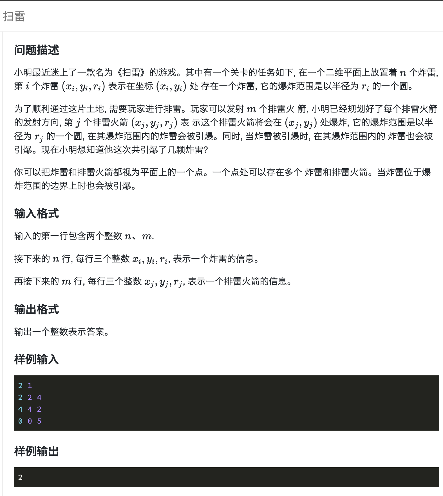
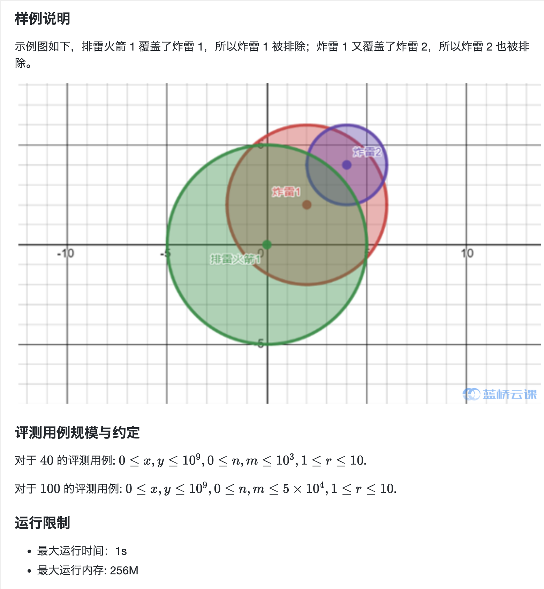

[](https://www.lanqiao.cn/problems/2113/learning/)

[](https://www.lanqiao.cn/problems/2113/learning/)


## code

(x, y, r) 存一颗雷或者火箭信息， 读入一个火箭，先找(x-r, x+r), (y-r, y+r)方形区域内的雷。再确定哪些落在圆内。圆内的雷按同样的方式先方形再圆形找被引爆的雷，直到没有雷可以引爆。

数据较大，`5*10^4`, 需要优化到O(nlogn)左右。可以给横坐标x,纵坐标y排序，查找时用二分查找。并且 `0 <= x, y <= 10^9`, 下标要做压缩。

### cpp

`map<int, map<int, unordered_map<int, int>>> mp`,    按<x, <y, <r, count>>> 存雷。 `mp[x][y][r]`：(x, y) 点爆炸半径为 r 有几颗雷。

- `res` 存结果，可以引爆几颗
- 读入扫雷火箭 x, y, r。放入队列`q`中。
- 每次在队列取出第一个(x, y, r), 找可以被引爆的其他雷
- 找在(x-r, x+r), (y-r,y+r) 方形区域内的雷，剪枝操作。
  - `xiter = mp.lower_bound(x - r)`, 二分查找 第一个不小于 x-r 的横坐标
  - `xed = mp.upper_bound(x + r)`, 二分查找 第一个大于 x+r 的横坐标
  - 横坐标范围: `[xiter->first, xed->first)`
- 横坐标确定后找满足条件的纵坐标
  - `yiter = xiter->second.lower_bound(y - r)`
  - `yed = xiter->second.upper_bound(y + r)`
  - `xiter->second` 也就是 `mp[x]`
  - 纵坐标范围: `[yiter->first, yed->first)`
- 判断炸弹`(xiter->first, yiter->first)`是否在引爆范围，如果在：
    - `yiter->second`也就是`mp[x][y]`, 得到key为半径`r`, value为`炸弹个数`的`unordered_map<int, int>`
  - 遍历以该点为圆心的炸弹`for(const auto& bm:yiter->second) `
  - `res += bm->second`也就是当前雷的个数，
  - 将雷(xiter->first, yiter->first, bm->first)放入队列
  - 删除该点的雷：
    - 先清空纵坐标, map[x].erase(y)，`yiter = xiter->second.erase(yiter)`。
    - 如果mp[x]全处理完后也为空，mp.erase(x), `xiter = mp.erase(xiter)`;
- 重复此过程，直到队列为空。 读入下一个扫雷火箭，直到所有火箭处理完。

```cpp
#include <bits/stdc++.h>
using namespace std;

const int fff = []() {ios::sync_with_stdio(false); cin.tie(nullptr); cout.tie(nullptr); return 0; }();

bool is_in_scope(long long x1, long long y1, long long r, long long x2, long long y2) {
    return (x1 - x2) * (x1 - x2) <= r * r - (y1 - y2) * (y1 - y2);
}

int main() {
    int n, m;
    cin >> n >> m;
    map<int, map<int, unordered_map<int, int>>> mp;
    for (int i = 0; i < n; i++) {
        int x, y, r;
        cin >> x >> y >> r;
        mp[x][y][r]++;
    }
    int res = 0;
    for (int i = 0; i < m; i++) {
        int x, y, r;
        cin >> x >> y >> r;
        queue<tuple<int, int, int>> q;
        q.emplace(x, y, r);
        while (!q.empty()) {
            x = get<0>(q.front());
            y = get<1>(q.front());
            r = get<2>(q.front());
            q.pop();
            for (auto xiter = mp.lower_bound(x - r), xed = mp.upper_bound(x + r); xiter != xed;) {
                for (auto yiter = xiter->second.lower_bound(y - r), yed = xiter->second.upper_bound(y + r); yiter != yed;) {
                    if (is_in_scope(x, y, r, xiter->first, yiter->first)) {
                        for(const auto& bm:yiter->second) {
                            res += bm.second;
                            q.emplace(xiter->first, yiter->first, bm.first);
                        }
                        yiter = xiter->second.erase(yiter);
                    } else {
                        yiter++;
                    }
                }
                if(xiter->second.empty()) {
                    xiter = mp.erase(xiter);
                } else {
                    xiter++;
                }
            }
        }
    }
    cout << res << endl;
    return 0;
}
```

### c

- `struct BM mp[50003]` 存炸弹信息，`mp[i].key = mp[i].x * 10^9 + mp[i].y` 这样炸弹坐标点就可以一维表示
- `bm_sort` 存炸弹下标，根据 `mp[bm_sort[i]].key` 排序
- 队列`q`用数组和循环下标模拟，存炸弹在`mp`中的下标, `bg`队列头， `ed` 队列尾， 添加`q[ed++]=?; ed %= 50003`, 取`q[bg]`, 删`bg = (bg + 1) % 50003`, `bg == ed`时队列空
- 每次读入炸弹数据放到`mp[n]`, 对列起始`bg=0, ed=1, q[0]=n`
- 队列中每个炸弹 `mp[q[bg]]`
    - 依然找方形区域内的点，key最小点:`(x-r, y-r)`, key最大点:`(x+r, y+r)`。所以只要找key在这两个范围内的即可。
    - 写二分查找，在`bm_sort`中找 `min_k <= mp[bm_sort[j]].key`, `mp[bm_sort[_l]] <= max_k`的最边缘值
    - 遍历`bm_sort j ~ _l`的点，如果点没有访问过`used[bm_sort[j]] == 0` 并且在半径范围内，标记为已访问，下标放入队列


```c
#include <stdio.h>
#include <stdlib.h>
struct BM {
    int x, y, r;
    long long key;
} mp[50003];

long long key(int x, int y) {
    return 1000000000LL * x + y;
}

int cmp(const void* a, const void* b) {
    long long k1 = mp[*(int*)a].key, k2 = mp[*(int*)b].key;
    return k1 == k2 ? 0 : (k1 < k2 ? -1 : 1);
}

int max(int a, int b) {
    return a < b ? b : a;
}

int main() {
    int n, m;
    scanf("%d%d", &n, &m);
    int bm_sort[50003];
    int used[50003] = {0};
    for (int i = 0; i < n; i++) {
        scanf("%d%d%d", &mp[i].x, &mp[i].y, &mp[i].r);
        mp[i].key = key(mp[i].x, mp[i].y);
        bm_sort[i] = i;
    }
    qsort(bm_sort, n, sizeof(int), cmp);
    int q[50003], res = 0;
    for (int i = 0; i < m; i++) {
        scanf("%d%d%d", &mp[n].x, &mp[n].y, &mp[n].r);
        q[0] = n;
        int bg = 0, ed = 1;
        while (bg != ed) {
            int x = mp[q[bg]].x, y = mp[q[bg]].y, r = mp[q[bg]].r;
            bg = (bg + 1) % 50003;

            long long min_k = key(max(0, x - r), max(0, y - r));
            long long max_k = key(x + r, y + r);
            int _l = 0, _r = n - 1;
            while (_l < _r) {
                int mid = (_l + _r) / 2;
                if (mp[bm_sort[mid]].key < min_k) {
                    _l = mid + 1;
                } else {
                    _r = mid;
                }
            }
            int j = _l;
            _l = 0, _r = n - 1;
            while (_l < _r) {
                int mid = (_l + _r) / 2;
                if (mp[bm_sort[mid]].key < max_k) {
                    _l = mid + 1;
                } else {
                    _r = mid;
                }
            }
            for (;j <= _l && j < n; j++) {
                int tmp_x = mp[bm_sort[j]].x, tmp_y = mp[bm_sort[j]].y;
                if (!used[bm_sort[j]] && 1LL * (x - tmp_x) * (x - tmp_x) <= 1LL * r * r - 1LL * (y - tmp_y) * (y - tmp_y)) {
                    used[bm_sort[j]] = 1;
                    q[ed++] = bm_sort[j];
                    ed %= 50003;
                    res++;
                }
            }
        }
    }
    printf("%d\n", res);
    return 0;
}
```