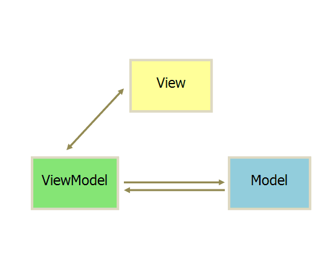
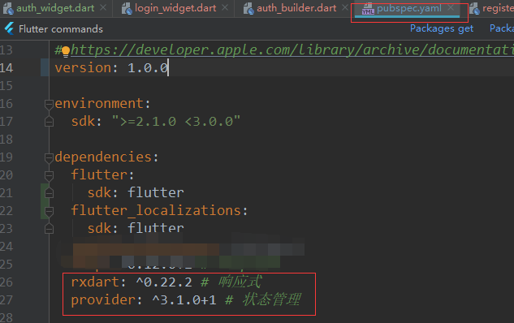
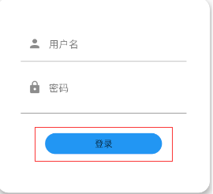
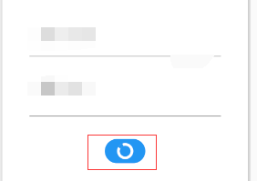
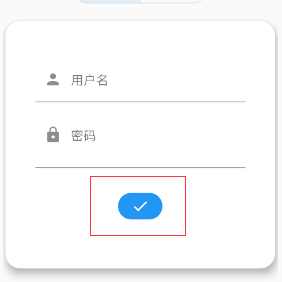

# flutter mvvm 模式

> ## [lzyprime 博客](http://lzyprime.github.io)
> #### 更新时间：2019.11.17  

## λ：

我的第一份`flutter`笔记，从选用那种架构模式开始。因为关于`flutter` 本身的 `安装，构建UI` 等等，比比皆是，除非疑难杂症，有必要鞋一份解决总结，其他的，官网和各大网站的手册和教材足够了。没必要功利到做个搬运工，从而赚取点击量

架构模式这种东西，跟你具体用什么语言、什么框架，关系不大。简单讲就是你怎么组织代码。便于逻辑清晰，更具条理。避免代码一整驼一整驼，甚至复制粘贴，全是重复、冗余代码。

***mvc -> mvp -> mvvm***, 不断演进与升级。了解一下分别是什么后，`mvvm` 的一大优势便是 `view` 与 `model` 双向绑定，任何一方的变动，都可以通知到另外一方。而另外两个，*几乎是* 单方主动请求

## mvvm



`viewModel` 作为 `view` 和 `model` 的中间者，处理`view`发出的请求，并在`model`数据等变化时，通知`view` 更新UI。

说起来很简单的样子。

## flutter项目 mvvm

### 1. 添加插件：`provider` , `rxdart`。 `pubspec.yaml` 文件



### 2. `view`， 构建UI，数据来源于`viewModel`

```dart
// file path : 'package:client/views/login_widget.dart'

import 'package:flutter/material.dart';

import 'package:client/view_models/login_view_model.dart'

class LoginWidget extends StatelessWidget {
  @override
  Widget build(BuildContext context) {
    final viewModel = Provider.of<LoginViewModel>(context); // 获取上层provider
    return Column(
      children: <Widget>[
        TextField(
          controller: viewModel.usernameController, // 方便viewModel 获取输入内容
        ),
        TextField(
          controller: viewModel.passwordController, // 方便viewModel 获取输入内容
        ),

        /// state 初始为 0，显示"登录" 字样；点击按钮后，加载过程值为 1；请求成功值为 2，显示对号
        FlatButton(
          child: viewModel.state == 0 
              ? Text("login")
              : (viewModel.state == 1
                  ? CircleAvatar(
                      backgroundColor: color,
                      child: CircularProgressIndicator(
                        backgroundColor: Colors.white,
                      ),
                      maxRadius: 10)
                  : Icon(
                      Icons.done,
                      color: Colors.white,
                    )),
          onPressed: viewModel.login,
        )
      ],
    );
  }
}
```

### 3. `model`, 请求和处理

```dart 
// file path : package:client/models/login_model.dart


class LoginModel {
    // 建立 future 对象的 observable
    Observable login(dynamic data) => Observable.fromFuture(
        http.post('http://api_url', body: data)
    );
}
```

### 4. `viewModel`
```dart
// file path : 'package:client/view_models/login_view_model.dart'

import 'package:client/models/login_model.dart';

/// with ChangeNotifer : 通过 notifyListeners() 函数，可以通知本对象数据的正在使用者们。 如 state 变量，在改变后调用 notifyListeners(), UI根据值重新构建登录按钮显示内容

class LoginViewModel with ChangeNotifier {
  final _model = LoginModel(); // model, 网络请求等处理

  final usernameController = TextEditingController();
  final passwordController = TextEditingController();
  int state = 0;

  /// login 请求需要的数据
  get _data => {
    'username': usernameController.text,
    'password': passwordController.text
   };

  void login() =>_model.login(_data)
  .doOnListen((){state = 1; notifyListeners();}) // 请求过程，state = 1, 显示加载，通知UI
  .listen(// listen 接收两个参数，成功后的处理，失败后的处理。
      (res){ 
    state = res['result'] == 0 ? 2 : 0; // 登录成功时，回包中的result 字段为 0;
    notifyListeners();
  }, (_){ // 请求出错
      state = 0;
      notifyListeners();
  });
}

```

### `main`， 组装三者
```dart
// import 

void main() => runApp(MyApp());

class MyApp extends StatelessWidget {
    final _loginViewModel = LoginViewModel();
  @override
  Widget build(BuildContext context) =>
  /// ChangeNotifierProvider
   ChangeNotifierProvider.value(
        value: _loginViewModel,
        child: MaterialApp(
        home: LoginWidget()
    );
  }
}
```

## 效果图

- ###  state == 0， 初始状态


- ### state == 1, 点击登录后，显示加载


- ### state == 2, 登录成功


## ~λ：

- 只是简单例子。mvvm作为思想，怎么抽离数据和ui视具体情况而定，灵活解决
- 插件只是为了更好组织，而且差价来自flutter官方团队，并不是第三方野路子。善于利用工具
- 也可尝试用原生 `InheritedWidget` 及其附属内容自己封装出`provider`的效果