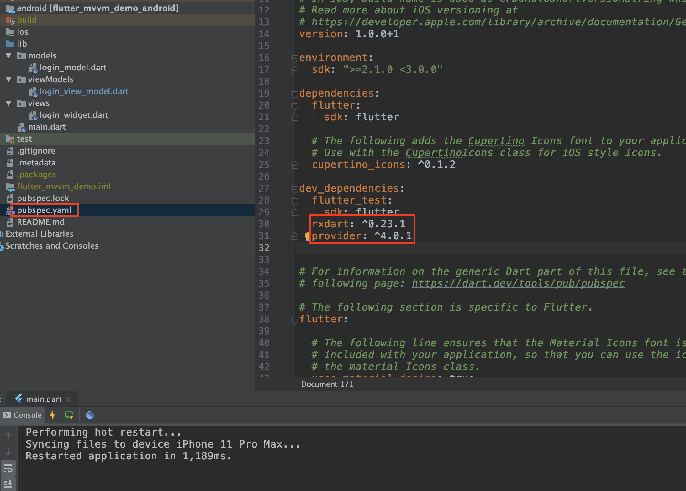
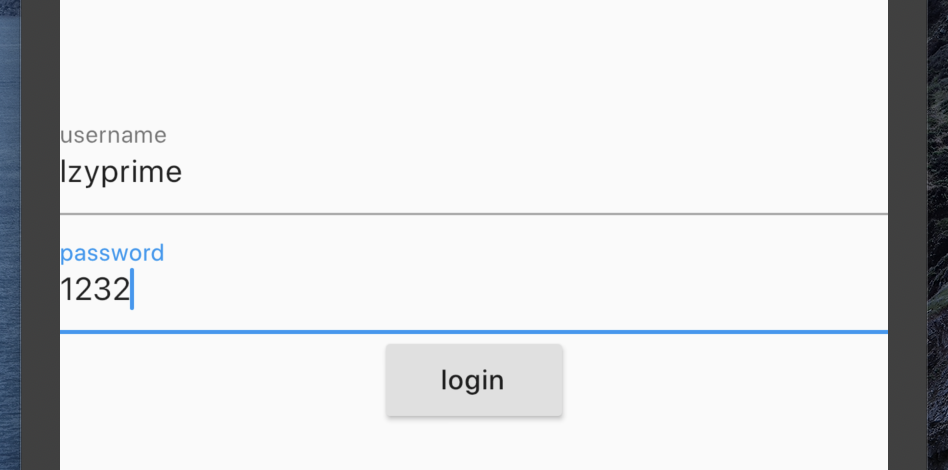
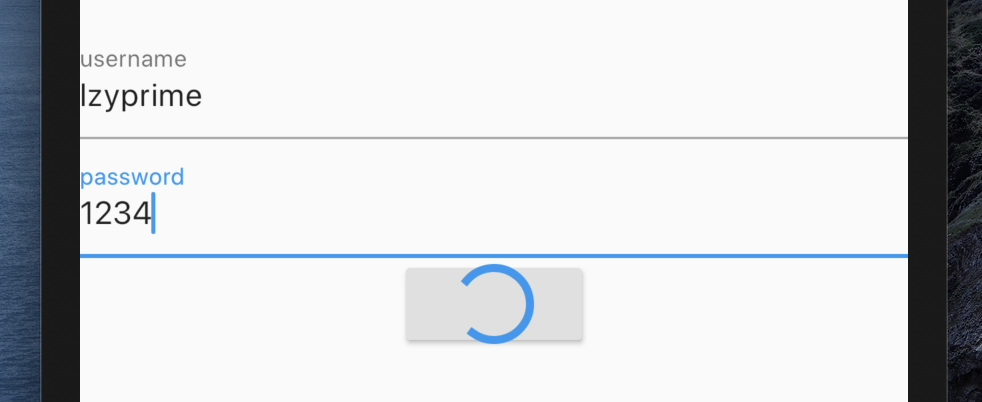
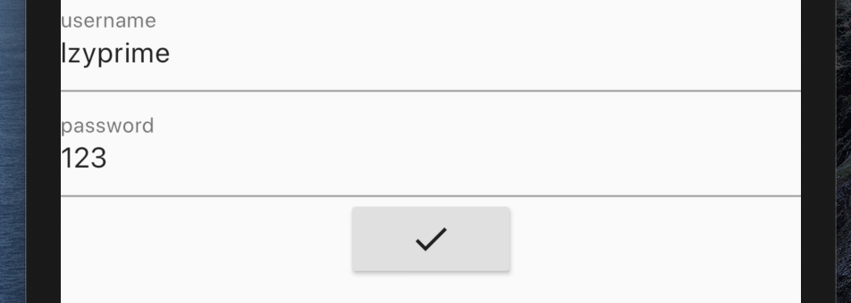
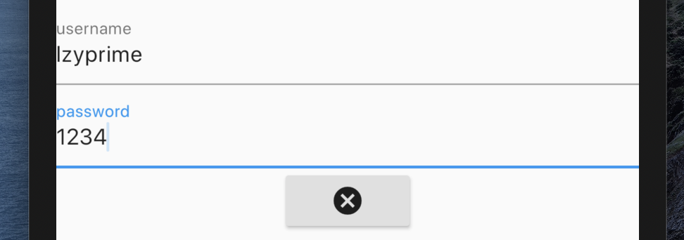

## λ：

这篇文章是对 “ [***19年11月的文章***](https://lzyprime.github.io/flutter/flutter_mvvm_模式.html) ”的补充， 就文章里用到的 `rxdart ^0.22.2` 与最新版本 `rxdart ^0.23.1` 出现了大改动，以至于原文中的代码在最新插件下不可用。。。

这次插件更新， 相当于给原生 `Stream` 类添加了一组拓展方法，而不是像以前一样用 `Observable` 类再包一层达到效果。（[详情rxdart的更新日志](https://pub.dev/packages/rxdart#-changelog-tab-))

也就是说，添加完插件后，你可以在任意`Stream` 调用一系列方法。如之前demo里用到的`doOnData doOnDone doOnListen zipWith`。还有更多内容可看[官网详情](https://pub.dev/packages/rxdart)

## [github 仓库: flutter_demos 分支 mvvm_demo](https://github.com/lzyprime/flutter_demos/tree/mvvm_demo)

```shell
git clone -b mvvm_demo https://github.com/lzyprime/flutter_demos.git
```

## mvvm
mvvm 在 [原文章](https://lzyprime.github.io/flutter/flutter_mvvm_模式.html) 大概介绍过，而且架构这种东西无关语言。具体是什么，相信wiki说的比我好。

## flutter项目 mvvm

### 1. 添加插件：`provider ^4.0.1`（`rxdart ^0.23.1` PS: 如果用不到 `rxdart` 的东西，可以不要这个插件）。 在 `pubspec.yaml` 文件



### 2. `view`， 构建UI，数据来源于`viewModel`

```dart
// file path: package:flutter_mvvm_demo/views/login_widget.dart

import 'package:flutter/material.dart';
import 'package:provider/provider.dart';

import 'package:flutter_mvvm_demo/viewModels/login_view_model.dart';

class LoginWidget extends StatelessWidget {
  @override
  build(BuildContext context) {
    final provider = Provider.of<LoginViewModel>(context);
    return Scaffold(
      body: Column(
        mainAxisAlignment: MainAxisAlignment.center,
        children: <Widget>[
          TextField(
            controller: provider.usernameController,
            decoration: InputDecoration(labelText: "username"),
          ),
          TextField(
            controller: provider.passwordController,
            decoration: InputDecoration(labelText: "password"),
          ),
          RaisedButton(
            onPressed: provider.login,

            /// 根据 state 的值，按钮显示不同内容。
            child: provider.state == 0
                ? Text("login")
                : provider.state == 1
                    ? CircularProgressIndicator()
                    : provider.state == 2
                        ? Icon(Icons.done)
                        : Icon(Icons.cancel),
          ),
        ],
      ),
    );
  }
}
```

### 3. `model`, 请求和处理

```dart 
// file path: package:flutter_mvvm_demo/models/login_model.dart

class LoginModel {
  /// 直接将网络请求的 Future 对象包装成 Stream 返回
  /// Stream.fromFuture 等构造方法。更多细节参考官方文档
  /// 因为是 demo 所以用 Future.delayed 模拟请求过程
   Stream<int> login(dynamic data) => Stream.fromFuture(
     Future.delayed(Duration(seconds: 2), () {
          if (data["username"] == "lzyprime" && data["password"] == "123")
            return 0;
          return -1;
        }),
   );
}

```

### 4. `viewModel`
```dart
// file path: package:flutter_mvvm_demo/view_models/login_view_model.dart

import 'package:flutter/material.dart';
// import 'package:rxdart/rxdart.dart'; 如果需要，自行添加插件

import 'package:flutter_mvvm_demo/models/login_model.dart';

/// with ChangeNotifier : 通过 notifyListeners() 函数，可以通知本对象数据的正在使用者们。
/// 如 state 变量，在改变后调用 notifyListeners(), UI根据值重新构建登录按钮显示内容
class LoginViewModel with ChangeNotifier {
  final _model = LoginModel();
  int state = 0; // 0 未请求，1 正在请求， 2 请求成功， 3请求失败
  final usernameController = TextEditingController();
  final passwordController = TextEditingController();

  login() {
    final data = {
      "username": usernameController.text,
      "password": passwordController.text,
    };

    /// 不为 0 说明上一条请求未完成，直接退出
    if (state != 0) return;

    /// 开始请求，state 赋值为 1， 并通知监听者
    /// 如果用rxDart插件，可作为doOnListen参数的函数体
    state = 1;
    notifyListeners();

    _model.login(data)

        /// rxDart 插件
//        .doOnListen(() {
//      state = 1;
//      notifyListeners();
//    })
        .listen((v) {
      if (v != 0) {
        /// 返回值不为0，请求失败
        state = 3;
        notifyListeners();
        Future.delayed(Duration(seconds: 1), () {
          state = 0;
          notifyListeners();
        });
      } else {
        /// 返回值为0，请求成功
        state = 2;
        notifyListeners();
        Future.delayed(Duration(seconds: 1), () {
          state = 0;
          notifyListeners();
        });
      }
    });
  }
}


```

### 组装三者
```dart
import 'package:flutter/material.dart';
import 'package:provider/provider.dart';

import 'package:flutter_mvvm_demo/views/login_widget.dart';
import 'package:flutter_mvvm_demo/viewModels/login_view_model.dart';

void main() => runApp(MyApp());

class MyApp extends StatelessWidget {
  // This widget is the root of your application.
  @override
  Widget build(BuildContext context) {
    return MaterialApp(
      title: 'Flutter mvvm Demo',
      theme: ThemeData(
        primarySwatch: Colors.blue,
      ),

      /// [ChangeNotifierProvider]。所有的viewModel通过 Provider 实现与view 层的绑定。
      /// Provider 是对 [InheritedWidget] 封装。因此我们才能实现调用notifyListeners() 时，通知子树重新构建
      /// 当然你也可以一个插件也不用，自己封装[InheritedWidget]
      home: ChangeNotifierProvider(
        create: (_) => LoginViewModel(),
        child: LoginWidget(),
      ),
    );
  }
}

```

## 效果图

- ###  state == 0， 未请求


- ### state == 1, 显示加载


- ### state == 2, 请求成功


- ### state == 3, 请求失败


## ～λ：

这只是个demo， 主要看三者怎么拆以及怎么拼装，实际请求肯定还要判好多问题。

实际应用时，`model`组织api请求，而一个页面可能涉及多个模块的请求，因此，一个 `viewModel` 包含多个 `model` 类也有可能。但尽量避免这种情况，做好请求分类