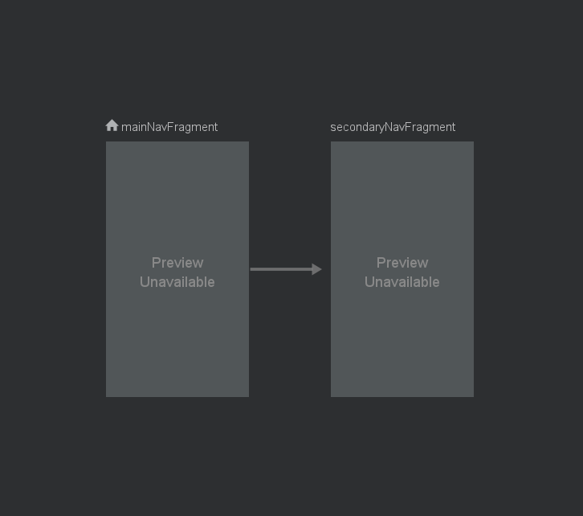
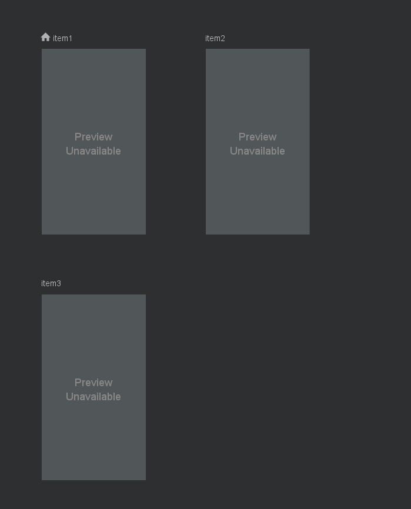
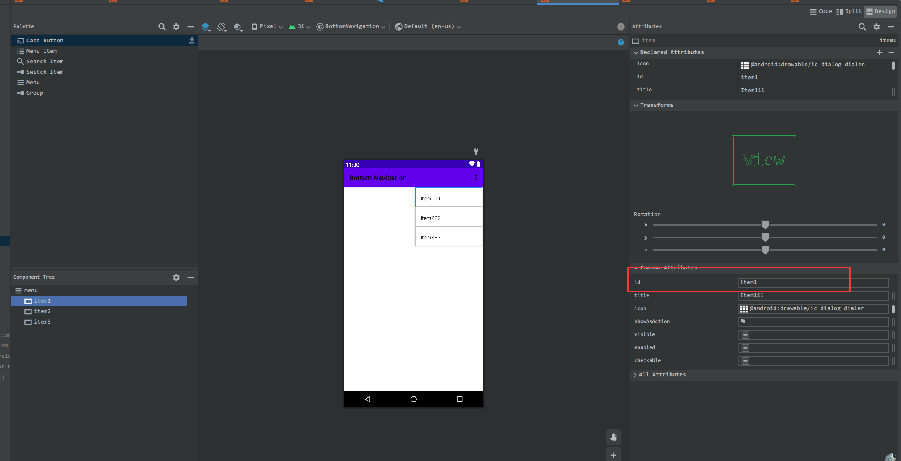

## λ：

> 2021.9.9更新： 之前版本把页面切换直接放进了Activity, 跳转其他页是靠启动新Activity。但实践中都是单Activity模式，所以重新整理一下。

```bash
# 仓库地址: https://github.com/lzyprime/android_demos
# branch: bottom_navigation

git clone -b bottom_navigation https://github.com/lzyprime/android_demos
```


底部导航配合多页面切换是常见逻辑，微信，qq，抖音，淘宝等等，常见app里几乎都有这种设计。

底部导航栏：`BottomNavgationView + menu`, 涉及到图标和标题在点击时的变化（颜色，大小，选中与未选中图标变化）

页面切换有两个方案：

1. [Navigation组件](https://lzyprime.github.io/kotlin_android/android_navigation)

2. [ViewPager2](https://developer.android.google.cn/guide/navigation/navigation-swipe-view-2)


参考 [使用 NavigationUI 更新界面组件](https://developer.android.google.cn/guide/navigation/navigation-ui)。 会发现用`navigation组件`实现页面切换可以一行代码搞定。但是单Activity模式下，会有NavHost嵌套，需要处理层级问题。并且默认情况下，页面是不保存状态的，切页面每次都重建，`2.4.0`会加saveState处理。

`ViewPager2`，底层是`RecyclerView`, 相比`Navgation`会有页面缓存，支持滑动切页手势，也不会有NavHost嵌套问题。

## Activity 

```yaml
Activity
|- MainNavHost
  |- MainNavFragment(home)
  | |- HomePageNavHost
  | | |- Item1Fragment(home)
  | | |- Item2Fragment
  | | |- Item3Fragment
  | | 
  | |- BottomNavgationView
  |  
  |  
  |- SecondaryFragment
    |- ViewPager
    | |- Item3Fragment(home)
    | |- Item2Fragment
    | |- Item1Fragment
    |- BottomNavgationView
```

项目总体层次图。问题主要出在`MainNavHost`,`HomePageNavHost`嵌套问题上。

```xml
<!-- activity_main.xml -->
<androidx.coordinatorlayout.widget.CoordinatorLayout ...>
    <androidx.fragment.app.FragmentContainerView
        ...
        android:id="@+id/mainNavHost"
        android:name="androidx.navigation.fragment.NavHostFragment"
        app:defaultNavHost="true"
        app:navGraph="@navigation/main_graph" />

</androidx.coordinatorlayout.widget.CoordinatorLayout>
```

Activity中只放一个`NavHostFragment`组织全局导航。 `defaultNavHost=true`拦截系统返回按钮, 执行`navigateUp`。

`main_graph`: 



## Navigation 实现页面切换

```xml
<!-- main_nav_fragment.xml -->
<LinearLayout ...>
    <androidx.fragment.app.FragmentContainerView
        ...
        android:id="@+id/homePageNavHost"
        android:name="androidx.navigation.fragment.NavHostFragment"
        app:navGraph="@navigation/main_nav_graph" />
    
    <com.google.android.material.bottomnavigation.BottomNavigationView
        ...
        android:id="@+id/mainBtmNavView"
        app:menu="@menu/main_nav_menu" />
</LinearLayout>
```

`main_nav_graph`:



`main_nav_menu`:



```kotlin
class MainNavFragment : Fragment(R.layout.main_nav_fragment) {
    private val binding by viewBinding<MainNavFragmentBinding>()
    override fun onViewCreated(view: View, savedInstanceState: Bundle?) {
        super.onViewCreated(view, savedInstanceState)
        val navController =
            (childFragmentManager.findFragmentById(R.id.homePageNavHost) as NavHostFragment).navController
        binding.mainBtmNavView.setupWithNavController(navController)
    }
}
```

通过`setupWithNavController`将NavHost与BottomNavgationView绑定。内部就是给BottomNavgationView设置Listener, 监听`onNavigationItemSelected(MenuItem item)`事件。然后通过`item.itemId`导航到同id目的地。

***所以，`menu` 中id要与 `导航图` 中一致***

但是如果想在子页面`Item1, Item2, Item3`操作全局导航，就要想办法拿到`MainNavHost`的navController：

```kotlin
class Item1Fragment : Fragment(R.layout.item1_fragment) {
    private val binding: Item1FragmentBinding by viewBinding()
    override fun onViewCreated(view: View, savedInstanceState: Bundle?) {
        super.onViewCreated(view, savedInstanceState)
        
        val globalNavHostController = requireActivity().findNavController(R.id.mainNavHost)
        ...
    }
}
```

按照层级关系，在子页面调用`findNavController()`会返回 `HomePageNavHost` 的 controller。所以要额外操作，去拿Activity中`MainNavHost`。 凡是`HomePageNavHost`嵌套图中的View都会有这种问题。


### ViewPager2

ViewPager2就不会有这些问题，因为在同一个NavHost下。

```xml
<!-- secondary_nav_fragment.xml -->
<?xml version="1.0" encoding="utf-8"?>
<LinearLayout ...>
    <androidx.viewpager2.widget.ViewPager2
        android:id="@+id/secondaryViewPager"
        ... />

    <com.google.android.material.bottomnavigation.BottomNavigationView
        android:id="@+id/secondaryBtmNavView"
        app:menu="@menu/secondary_nav_menu" 
        ... />
</LinearLayout>
```

```kotlin
class SecondaryNavFragment : Fragment(R.layout.secondary_nav_fragment) {
    private val binding by viewBinding<SecondaryNavFragmentBinding>()

    private val fragments = arrayOf(Item3Fragment(), Item2Fragment(), Item1Fragment())
    private val itemIds = arrayOf(R.id.item3, R.id.item2, R.id.item1)

    override fun onViewCreated(view: View, savedInstanceState: Bundle?) {
        super.onViewCreated(view, savedInstanceState)
        binding.secondaryViewPager.adapter = object : FragmentStateAdapter(this) {
            override fun getItemCount(): Int = fragments.size
            override fun createFragment(position: Int): Fragment = fragments[position]
        }

        binding.secondaryViewPager.offscreenPageLimit = fragments.size

        //binding.secondaryViewPager.isUserInputEnabled = false // 禁用滑动

        binding.secondaryViewPager.registerOnPageChangeCallback(object :
            ViewPager2.OnPageChangeCallback() {
            override fun onPageSelected(position: Int) {
                binding.secondaryBtmNavView.selectedItemId = itemIds[position]
            }
        })

        binding.secondaryBtmNavView.setOnItemSelectedListener {
            binding.secondaryViewPager.currentItem = itemIds.indexOf(it.itemId)
            true
        }
    }

}
```

ViewPager2设置：

- 设置 `FragmentStateAdapter`。由于ViewPager2底层是RecyclerView, 所以这肯定是个`RecyclerView.Adapter`子类。
- `offscreenPageLimit`， 缓存页面数
- 注册 `OnPageChangeCallback`，监听页面滑动，页面切换完成时，设置底部导航栏选中项。
- 如果不想滑动切换页面, `isUserInputEnabled = false`

BottomNavigationView设置：

设置点击事件监听，`ViewPager2` 跳转对应页面。

