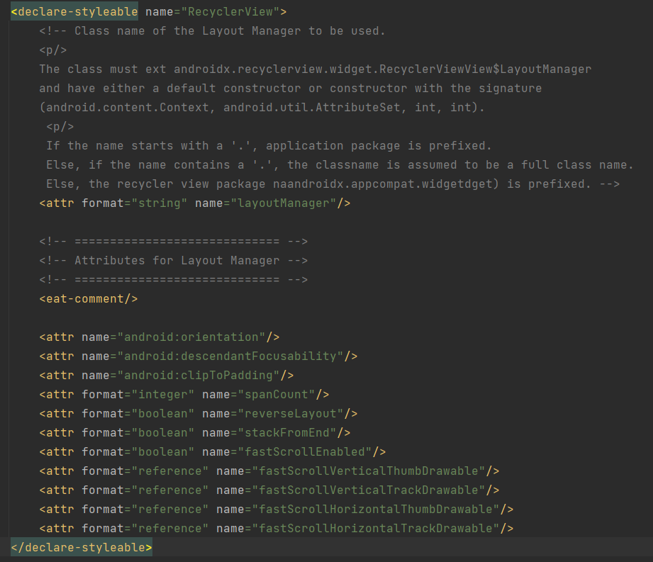
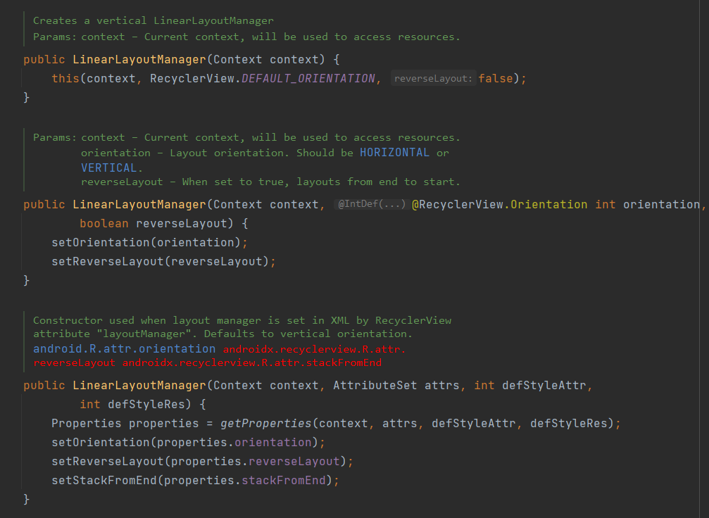
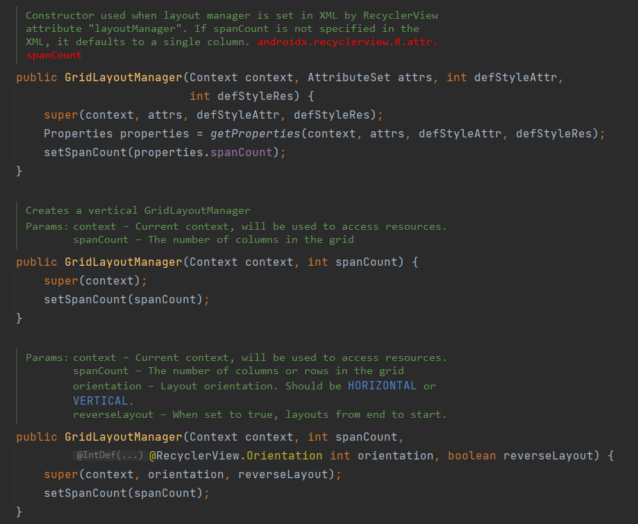
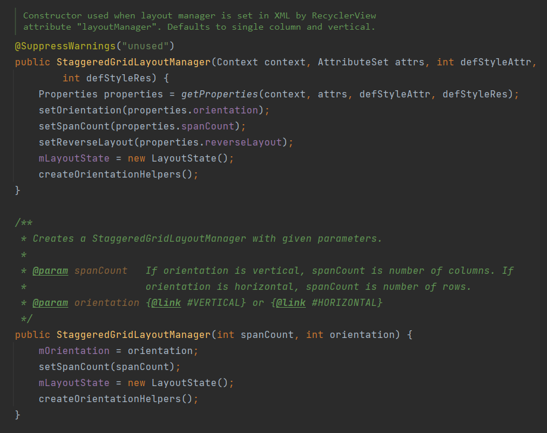

# λ：

`RecyclerView`作 Android 列表项的展示组件。相比`ListView`，缓存机制做的更细致，提升流畅度。以空间换时间

两个重要参数：
1. `LayoutManager`: 排版
2. `RecyclerView.Adapter`: 列表项获取方式

# LayoutManager

`LayoutManager` 可以在`xml`中直接配置. 也可在逻辑代码中设置。

```xml
// xml
   <androidx.recyclerview.widget.RecyclerView
        ...
        // LayoutManager类型
        app:layoutManager="androidx.recyclerview.widget.GridLayoutManager"
        // 几栏
        app:spanCount="1"
        />
```

全部可配参数：



## 1. LinearLayoutManager

```kotlin
public class LinearLayoutManager extends RecyclerView.LayoutManager implements
        ItemTouchHelper.ViewDropHandler, RecyclerView.SmoothScroller.ScrollVectorProvider
```

单栏线性布局。无法多栏展示。构造函数参数：

1. orientation: 方向
2. reverseLayout: 反转，倒序列表项

> stackFromEnd 用来兼容 android.widget.AbsListView.setStackFromBottom(boolean)。相当于reverseLayout 的效果。

同时实现了`ItemTouchHelper.ViewDropHandler`, `RecyclerView.SmoothScroller.ScrollVectorProvider`




## 2. GridLayoutManager

```kotlin
public class GridLayoutManager extends LinearLayoutManager
```

网格布局。`LinearLayoutManager` 升级版，可以通过`spanCount`设置分几栏



## 3. StaggeredGridLayoutManager

```kotlin
public class StaggeredGridLayoutManager extends RecyclerView.LayoutManager implements
        RecyclerView.SmoothScroller.ScrollVectorProvider
```

流布局。 当列表项尺寸不一致时, `GridLayoutManager` 根据尺寸较大项确定网格尺寸。导致较小项会有空白部分。`StaggeredGridLayoutManager` 则紧凑拼接每一项。 通过 `setGapStrategy(int)` 设置间隙处理策略。




## Adapter

### `RecyclerView.Adapter<VH : RecyclerView.ViewHolder>`
```java
public abstract static class Adapter<VH extends ViewHolder> {
    ...
    @NonNull
    public abstract VH onCreateViewHolder(@NonNull ViewGroup parent, int viewType);

    public abstract void onBindViewHolder(@NonNull VH holder, int position);

    public abstract int getItemCount();
}

public abstract static class ViewHolder {
    public ViewHolder(@NonNull View itemView) { ... }
}
```

一个`Adapter`至少需要`override`这三个函数。 其他常用：

```kotlin
public int getItemViewType(int position)
```

#### `onCreateViewHolder`, `getItemViewType`

创建一个`ViewHolder`, 如果 `VH` 有多种类型，可以通过`viewType`参数判断。 而此参数靠 `getItemViewType` 函数控制。默认返回0。

以聊天消息为例:

```kotlin
sealed class Msg {
    data class Text(val content: String) : Msg()
    data class Image(val url: String) : Msg()
    data class Video(...) : Msg()
    ...
}

class MsgListAdapter : RecyclerView.Adapter<MsgListAdapter.MsgViewHolder>() {
    sealed class MsgViewHolder(itemView: View) : RecyclerView.ViewHolder(itemView) {
        class Text(...) : MsgViewHolder(...)
        class Image(...) : MsgViewHolder(...)
        ...
    }

    private var data: List<Msg> = listOf()

    override fun getItemViewType(position: Int): Int =
        when (data[position]) {
            is Msg.Text -> 1
            is Msg.Image -> 2
            ...
        }

    override fun onCreateViewHolder(parent: ViewGroup, viewType: Int): MsgViewHolder {
        when (viewType) {
            1 -> MsgViewHolder.Text(...)
            2 -> MsgViewHolder.Image(...)
        }
    }
}
```