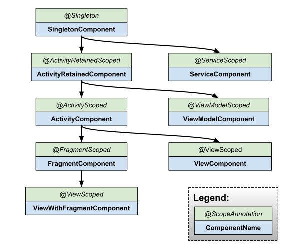

## λ：

##### 仓库地址: [https://github.com/lzyprime/android_demos](https://github.com/lzyprime/android_demos)

开发分支`dev`加入了`compose`, 图片库由 `glide` 换为 `coil`, `DataStore`代替`SharedPreference`。 同时剔除掉`LiveData`, 用`Flow`代替。

本来想完全用`compose`完成UI实现。但是目前`compose`组件贫瘠，与其他库的配合库也都没有稳定。部分场景下实现反倒费力。所以开两个分支：

- `dev`:  `compose` 只做部分控件实现，主体仍保留传统库和其他方式。
- `dev_compose`: `view` 层完全用 `compose` 实现，包括路由导航。删除`layout, navgation, menu`等文件夹，删除`compose 以外`的依赖。

`hilt` 或者 `koin` 做依赖注入是贯穿全局的。所以得先会这个

> [android依赖注入 官网文档](https://developer.android.google.cn/training/dependency-injection)

> [hilt 官网](https://dagger.dev/hilt/)

> [koin 官网](https://insert-koin.io/)

关于文档，还是尽量看英文原版。原版文档本身有一定延迟，而中文文档翻译又会延迟一段。就导致文档里api可能已过时，内容废弃等问题。比如`hilt`在android官网的文档。中文版本还是`alpha`版本的，`@ViewModelInject`接口已经废弃等.

当然中文文档中介绍和原理部分还是可以参考，即使api改变了，这种东西一般也不会变。

## 共性：

无论是哪个库，原理都是一样的：

1. 根据`Application, Activity, Fragment`等为范围，开不同的容器`Container`。

2. 所依赖的实例从`Container`中获得，并以单例存在于`Container`中

> [Android 手动依赖注入文档](https://developer.android.com/training/dependency-injection/manual)

```kotlin
//example
    class MyApplication : Application() {
        val appContainer = AppContainer()
        ...
    }

    class LoginActivity: Activity() {

        private lateinit var loginViewModel: LoginViewModel

        override fun onCreate(savedInstanceState: Bundle?) {
            super.onCreate(savedInstanceState)

            val appContainer = (application as MyApplication).appContainer
            loginViewModel = LoginViewModel(appContainer.userRepository)
        }
    }
```

手动依赖注入问题：

- 必须自行管理 `Container`，手动为依赖项创建实例，根据生命周期移除实例
- 样板代码
- `ViewModel`依赖注入，要靠`ViewModelProvider.Factory`才可以复用`Jetpack`中的获取方式. 或者放进容器，自己维护`ViewModel`生命周期。

依赖注入有什么好处是老生常谈。当然可以不用，通篇`object`, 直接就单例，到处可以使用。 

依赖注入优势，官网给的总结：

- 重用类以及分离依赖项：更容易换掉依赖项的实现。由于控制反转，代码重用得以改进，并且类不再控制其依赖项的创建方式，而是支持任何配置。
- 易于重构：依赖项成为 API Surface 的可验证部分，因此可以在创建对象时或编译时进行检查，而不是作为实现详情隐藏。
- 易于测试：类不管理其依赖项，因此在测试时，您可以传入不同的实现以测试所有不同用例。

## Hilt

`Hilt`做法是改变并拓展基类，比如继承自`class XXApplication : Application()`的，编译器插件生成`Hilt_XXApplication`类，在里边实现容器维护。也就是变为`class XXApplication : Hilt_XXApplication()`。可以看生成的代码。

### 开容器

通过`@HiltAndroidApp, @AndroidEntryPoint`标记，生成对应基类，在基类里实现容器的维护逻辑。

```kotlin
@HiltAndroidApp
class UnsplashApplication : Application()

@AndroidEntryPoint
class MainActivity : AppCompatActivity()
```

### @Inject 标记需要注入项

```kotlin
class UnsplashRepository @Inject constructor(private val service: UnsplashService)

@AndroidEntryPoint
class MainActivity : AppCompatActivity() {
    @Inject lateinit var service: XXService
    ...
}
```

### 注册实例获取方式

创建 `@Module`, 通过 `@Provides` 和 `@Binds` 标记实例获取方式，并通过 `@InstallIn` 标记实例放在哪个容器里。

#### @Binds

```kotlin
interface XXService { ... }

class XXServiceImpl @Inject constructor(...) : XXService { ... }

@Module
@InstallIn(ActivityComponent::class)
abstract class XXModule {
    
  @Binds
  abstract fun bindAnalyticsService(impl: XXServiceImpl): XXService
}

// or

@Module
@InstallIn(ActivityComponent::class)
interface XXModule {
    
  @Binds
  fun bindAnalyticsService(impl: XXServiceImpl): XXService
}
```

#### @Provides

```kotlin
@Module
@InstallIn(SingletonComponent::class)
object XXModule {
  @Provides
  fun provideSDKManager(aInject:A, bInject:B): SDKManager = SDK.getManager(aInject, bIject)

  @Singleton
  @Provides
  fun provideYYService():YYService = Retrofit....create(YYService::class.java)
}
```

两种方式都可以标记某个实例的获取方式。`@Bind`的参数内容是可以通过依赖注入得到的，然后会把它作为返回内容。`@Provides`可以提供具体构造方式, 比如`Retrofit`创建实例的过程。当然全写成`Provides`也是可以跑的。

`@InstallIn(XXX::class)` 标记`Module`存放在哪个容器中，也就是它的范围。参照表：

|component | 注入到 | create at | destroyed at|
|:-:|:-:|:-:|:-:|
|SingletonComponent|Application|Application#onCreate()|Application#onDestroy()|
|ActivityRetainedComponent|N/A|Activity#onCreate()|Activity#onDestroy()|
|ActivityComponent|Activity|Activity#onCreate()|Activity#onDestroy()|
|ViewModelComponent|ViewModel|ViewModel created |ViewModel destroyed|
|FragmentComponent|Fragment|Fragment#onAttach()|Fragment#onDestroy()|
|ViewComponent|View|View#super() | View destroyed|
|ViewWithFragmentComponent|View annotated with @WithFragmentBindings|View#super()|View destroyed|
|ServiceComponent|Service|Service#onCreate()|Service#onDestroy()|

所以在`Provides`例子中，范围是`SingletonComponent`，此时函数上打了 `@Singleton`标签。作用是限定函数只调用一次，产生的实例以单例形式存在。因为`Activity, Fragment`等都能拿到`Module`，如果不打，则他们会各自维护一份的单例。

没有 `@InstallIn(ActivityRetainedComponent::class)`。

每一个其实就是对应一个容器，要么自己维护，要么挂到其他容器下。

#### 容器关系

`Hilt` 就是个 `Dagger` 的API层，限定简化了注入方式。所以 `@HiltAndroidApp`, `@AndroidEntryPoint` 最后还是 `Dagger` 实现。看一下生成的代码，大概就通过 `EntryPoint` 一层层关联起容器。就算没搞过 `Dagger` 也大概能看懂过程：

`Application` 中会创建 `ApplicationComponentManager`。同时提供下层容器单例的获取方式等。把自己放进 `SingletonComponent`。

```kotlin
// Activity 创建自己的ActivityComponentManager
class Hilt_XXXActivity {
    val componentManager: ActivityComponentManager
    protected fun inject() {
        (componentManager.generatedComponent as Injector).inject(this as XXXActivity)
    }
}

class ActivityComponentManager(val activity:Activity) {
    val activityRetainedComponentManager = ActivityRetainedComponentManager(activity as ComponentActivity)

    fun generatedComponent() = activityRetainedComponentManager.generatedComponent()
}

class ActivityRetainedComponentManager(val activity: ComponentActivity) {
    val viewModelProvider = ViewModelProvider(activity, Factory {
        return ActivityRetainedComponentViewModel(
            // 也就是 ActivityRetainedComponent 的单例
            (获取Application).activityRetainedComponentBuilder.build()
        )
    })

    fun generatedComponent() = viewModelProvider.get(ActivityRetainedComponentViewModel.class).getComponent()
}

class ActivityRetainedComponentViewModel(val component : ActivityRetainedComponent) : ViewModel() {
    fun getComponent() = component
    override fun onCleared() {
        getActivityRetainedLifecycle().dispatchOnCleared()
    }
}

@ActivityRetainedScoped
@DefineComponent(parent = SingletonComponent.class)
public interface ActivityRetainedComponent {}
```

简化一下, 也就是把自己放进了 `ActivityRetainedComponent` 单例, 并通过ViewModel生命周期，在销毁时，摘掉自己: 

```kotlin
class Hilt_XXXActivity {
    val componentManager: ActivityComponentManager
    protected fun inject() {
        activityRetainedComponentImpl.inject(this as XXXActivity)
    }
}
```

而 `ActivityRetainedComponent` 单例在构造时，会包含 `SingletonComponent` 的单例。`ActivityComponent` 中会包含这两个的单例。 同理依次类推。

除此之外，也可以通过标记作用域的方式，标记存放在哪个容器中，如:

```kotlin
@Singleton // 放入SingletonComponent中
class UserRepository @Inject constructor(...)
```

对照表：

| class | component	| Scope |
|:-:|:-:|:-:|
|Application|SingletonComponent|@Singleton|
|Activity|ActivityRetainedComponent|@ActivityRetainedScoped|
|ViewModel|ViewModelComponent|@ViewModelScoped|
|Activity|ActivityComponent|@ActivityScoped|
|Fragment|FragmentComponent|@FragmentScoped|
|View|ViewComponent|@ViewScoped|
|View annotated with @WithFragmentBindings|	ViewWithFragmentComponent | @ViewScoped |
|Service|ServiceComponent|@ServiceScoped|

源码比这绕口的多，但大致流程如此。这也是为什么低层次的可以直接用高层次里的东西。

官方给的关系图：



#### 为实例提供多个获取方式

```kotlin
// 限定符
@Qualifier
@Retention(AnnotationRetention.BINARY)
annotation class DebugService

@Qualifier
@Retention(AnnotationRetention.BINARY)
annotation class ReleaseService

// module
@Module
@InstallIn(ApplicationComponent::class)
object NetworkModule {

  @DebugService
  @Provides
  fun provideDebugService(): XXService = XXService(debug_url)

  @ReleaseService
  @Provides
  fun provideReleaseService(): XXService = XXService(release_url)
}

// use
class UserRepository @Inject constructor(
    @DebugService service: XXService
)

// or
class Example {
    @ReleaseService
    @Inject lateinit var okHttpClient: OkHttpClient
}
```

预设限定符：`@ApplicationContext` 和 `@ActivityContext`

```kotlin
class AnalyticsAdapter @Inject constructor(
    @ApplicationContext private val context: Context,
    private val service: AnalyticsService
) { ... }
```

### ViewModel

使用 `@HiltViewModel` 标记，在Activity中仍然可以通过 `by viewModels()` 的方式获取到。

```kotlin
@HiltViewModel
class ExampleViewModel @Inject constructor(
  private val savedStateHandle: SavedStateHandle,
  private val repository: ExampleRepository
) : ViewModel() {
  ...
}

@AndroidEntryPoint
class ExampleActivity : AppCompatActivity() {
  private val exampleViewModel: ExampleViewModel by viewModels()
  ...
}
```

要了解如何做到的，首先要知道`by viewModels()`如何实现。完整的函数是:

```kotlin
@MainThread
public inline fun <reified VM : ViewModel> ComponentActivity.viewModels(noinline factoryProducer: (() -> Factory)? = null)
```
要传 `ViewModel Factory` 获取方式。 当为默认值(null)时，会调用`Activity#getDefaultViewModelProviderFactory` 得到 `Factory`。

而 `Hilt` 实现的注入方式，就是改变并拓展基类。所以在生成的Activity基类里，`override`这个方法，先去`Hilt`容器中找，没有匹配的则返回默认行为。

这是 `Koin` 与 `Hilt` 明显差别之一。 `Koin` 类似于把手动注入的过程封装一下，所以`koin` 库做了`by viewModel()`函数，用于在容器获取。

### Navigation

可以以导航图为单位共享一个 `ViewModel`

```kotlin
val viewModel: ExampleViewModel by hiltNavGraphViewModels(R.id.my_graph)
```

### gradle plugin 生成代码

得益于`Hilt`通过`Gradle Plugin`生成代码, 否则我们就要：

```kotlin
@HiltAndroidApp(Application.class)
class FooApplication : Hilt_FooApplication

@AndroidEntryPoint(FragmentActivity.class)
class FooActivity : Hilt_FooActivity

...
```

但是以注解和编译器插件做的坏处是拖慢了编译速度，尤其是项目大了之后。因为有 `kotlin -> java -> kotlin` 的反复横跳。当然好处是兼容`java`，还有就是`kotlin`编译器插件没稳定。编译时间问题希望之后能优化，或者有更好方案。

## Koin

当了解了容器的概念，再来看`Koin`，或者其他依赖注入库就很容易理解。`Koin` 源码在 `github` 有，可以自己扒。或者猜测一下实现，看库是不是与自己一样。或者觉得库哪些内容实现不优雅不好，有无更好的方案或写法。

这个库相当于提供容器维护的api。所以要手动做的事会多一点。得益于`kotlin`语法，提供的api也是简洁，灵活。

### 开容器

`Koin` 通过 `startKoin`

```kotlin
class MainApplication : Application() {

    override fun onCreate() {
        super.onCreate()

        startKoin {
            // Koin Android logger
            androidLogger()
            //inject Android context
            androidContext(this@MainApplication)
            // use modules
            modules(myAppModules)
        }
        
    }
}
```

### 标记需要注入项

`by inject()`

```kotlin
class MySimpleActivity : AppCompatActivity() {
    val firstPresenter: MySimplePresenter by inject()
}
```

`get()`

```kotlin
class MySimpleActivity : AppCompatActivity() {
    override fun onCreate(savedInstanceState: Bundle?) {
        super.onCreate(savedInstanceState)
           val firstPresenter: MySimplePresenter = get()
    }
}
```

### 注册实例获取方式

```kotlin
val appModule = module {

    // single instance of HelloRepository
    single<HelloRepository> { HelloRepositoryImpl() }

    // Simple Presenter Factory
    factory { MySimplePresenter(get()) }
}
```

```kotlin
startKoin {
    ...
    // use modules
    modules(myAppModules)
}
```

`module` 有详细文档。至于实例的生命周期和作用域，肯定靠`module`和`startKoin`注册方式维护。

### ViewModel

```kotlin
class MyViewModel(val repo : HelloRepository) : ViewModel() {...}
```

```kotlin
val appModule = module {
    // single instance of HelloRepository
    single<HelloRepository> { HelloRepositoryImpl() }

    // MyViewModel ViewModel
    viewModel { MyViewModel(get()) }
}
```

由于注入方式相当于手动维护容器，所以`ViewModel`也需要注册获取方式。

```kotlin
class MyViewModelActivity : AppCompatActivity() {   
    val myViewModel: MyViewModel by viewModel()
}
```

## ～λ：

其他详细内容可看文档和源码。两个库各有优劣，相比`Koin`, `Hilt`可能少写点东西，而且底层是`Dagger`，觉得提供的工具不够用时，可以直接用`Dagger`胡搞。***编译真的慢***， 这几天刚把公司项目加了`Hilt`，感觉编译长了1.5倍左右。当然项目不算大，总体也耗不了多久，可以接受。

