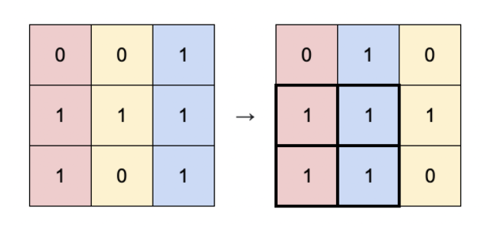

## [leetcode 笔记](https://lzyprime.github.io/leetcode/leetcode)

---

## 题目描述

给你一个二进制矩阵 matrix ，它的大小为 m x n ，你可以将 matrix 中的 列 按任意顺序重新排列。

请你返回最优方案下将 matrix 重新排列后，全是 1 的子矩阵面积。


示例 1：



```
输入：matrix = [[0,0,1],[1,1,1],[1,0,1]]
输出：4
解释：你可以按照上图方式重新排列矩阵的每一列。
最大的全 1 子矩阵是上图中加粗的部分，面积为 4 。
```

示例 2：


```
输入：matrix = [[1,0,1,0,1]]
输出：3
解释：你可以按照上图方式重新排列矩阵的每一列。
最大的全 1 子矩阵是上图中加粗的部分，面积为 3 。
```

示例 3：

```
输入：matrix = [[1,1,0],[1,0,1]]
输出：2
解释：由于你只能整列整列重新排布，所以没有比面积为 2 更大的全 1 子矩形。
```

示例 4：

```
输入：matrix = [[0,0],[0,0]]
输出：0
解释：由于矩阵中没有 1 ，没有任何全 1 的子矩阵，所以面积为 0 。
```

提示：

```
m == matrix.length
n == matrix[i].length
1 <= m * n <= 105
matrix[i][j] 要么是 0 ，要么是 1 。
```

> 来源：力扣（LeetCode）  
> 链接：https://leetcode-cn.com/problems/largest-submatrix-with-rearrangements  
> 著作权归领扣网络所有。商业转载请联系官方授权，非商业转载请注明出处。

## code

- ### c++

```c++
class Solution {
public:
    int largestSubmatrix(vector<vector<int>>& matrix) {
        int rsize = matrix.size();
        int csize = matrix[0].size();
        for (int i = 1; i < rsize; i++)
            for (int j = 0; j < csize; j++)
                if (matrix[i][j])
                    matrix[i][j] += matrix[i - 1][j];
        int ans = 0;
        for (auto& i : matrix) {
            sort(i.begin(), i.end());
            for (int j = 1; j <= csize; j++)
                ans = max(ans, i[csize - j] * j);
        }
        return ans;
    }
};
```